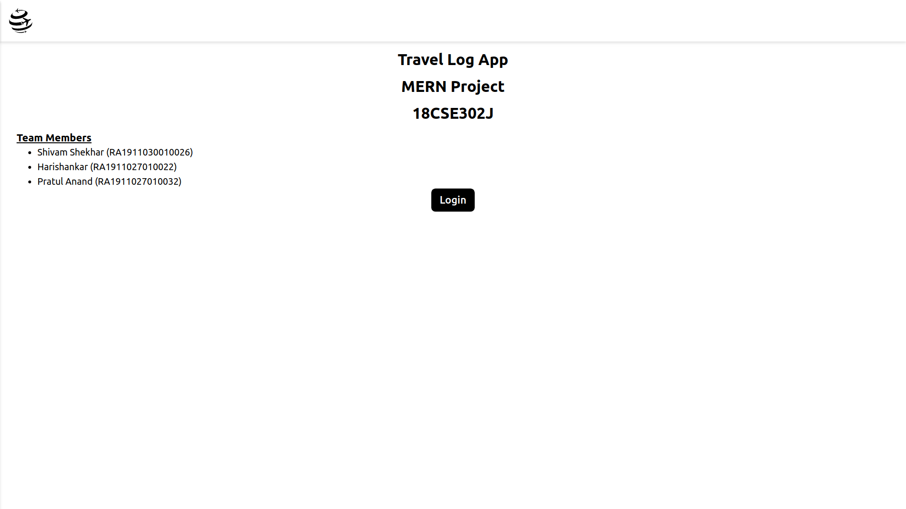
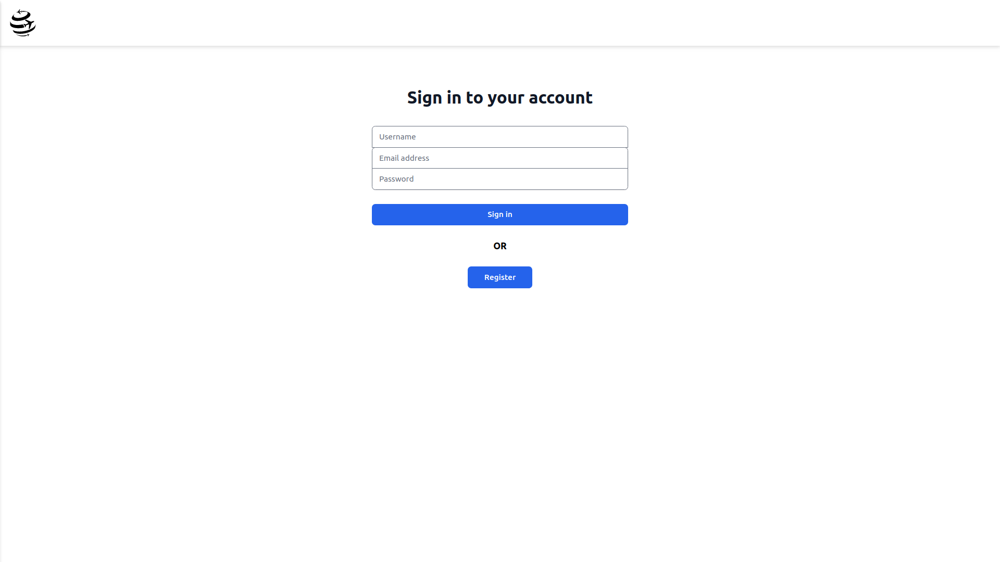
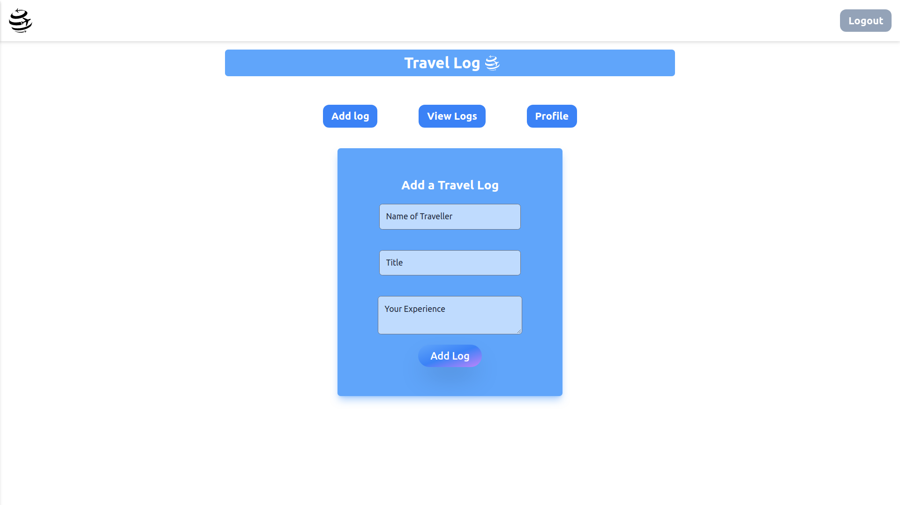
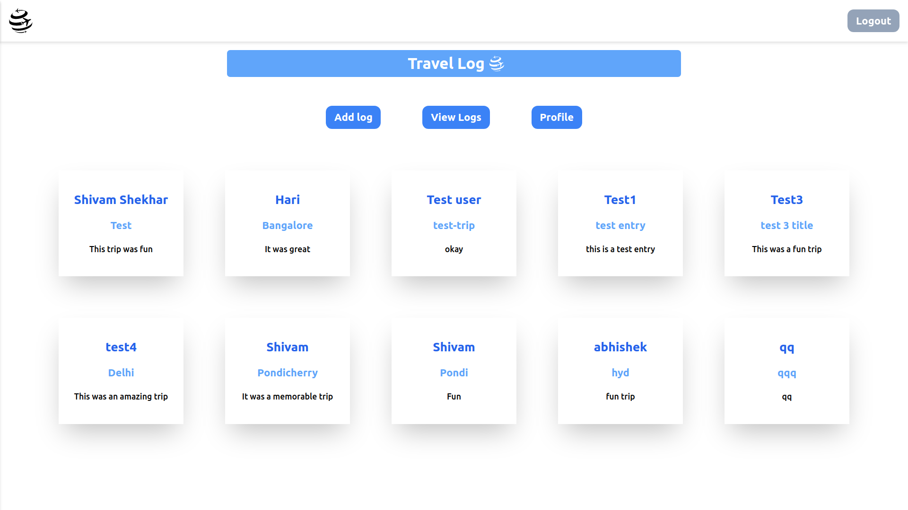
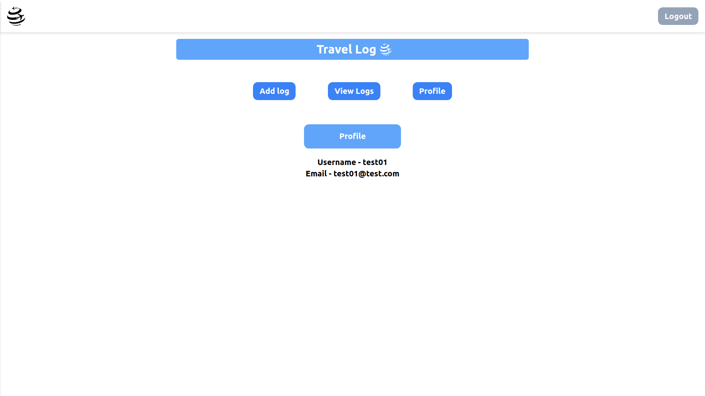

# Travel Log App

Travel Log allows users to share their recent trip experiences to entire world for their references. This is a very similar feature to what Trivago has where people can share their itineraries of trips.

```
Team members
 - Shivam Shekhar (RA1911030010026)
 - Harishankar P V (RA1911027010022)
 - Pratul Anand (RA1911027010032)

Subject: MERN (18CSE302J)
```

## Tech Stack

### Frontend

- Next.js
- TypeScript
- TailwindCSS

### Backend

- Node.js
- Express.js

### Database

- MongoDB

## Preview






